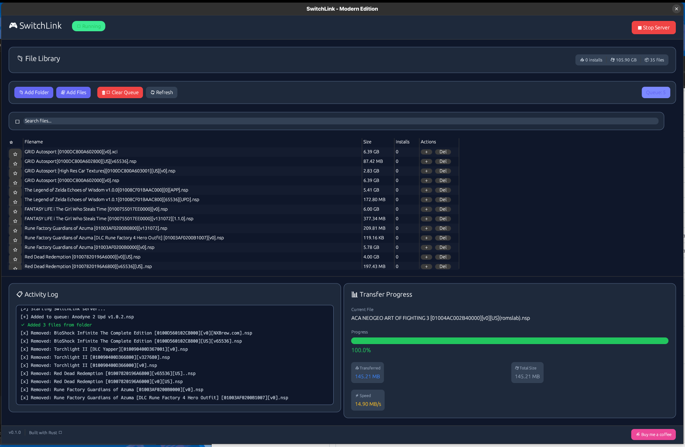

# 🎮 SwitchLink

High-performance Nintendo Switch file transfer system with modern GUI.



> **Inspired by [DBI](https://github.com/rashevskyv/dbi)** - The original Nintendo Switch installer

## ✨ Features

### Backend (PC)

- 🚀 **Fast Transfers** - ~45 MB/s over USB
- 🎨 **Modern GUI** - Beautiful dark theme with card-based design
- 📁 **File Library** - Database-backed with favorites and search
- 📊 **Real-time Progress** - Speed, ETA, and transfer stats
- 🔄 **Queue System** - Batch transfer multiple files

### Client (Nintendo Switch)

- 📱 **Clean UI** - ANSI-based terminal interface
- ⬇️ **Fast Downloads** - 1MB chunk transfers
- ❌ **Cancel Support** - Press B to cancel with confirmation
- 📜 **File Browser** - Navigate with D-Pad, page with L/R

## 🚀 Quick Start

### Prerequisites

**PC (Backend):**

```bash
# Linux
sudo apt-get install libusb-1.0-0-dev

# Build
cargo build --release
./target/release/switchlink-backend
```

**Nintendo Switch (Client):**

1. Download `switchlink-client.nro` from [Releases](https://github.com/silkyland/switchlink/releases)
2. Copy to `/switch/` folder on SD card
3. Launch from Homebrew Menu

### Usage

1. **PC**: Start SwitchLink Backend, add files to queue
2. **Switch**: Launch SwitchLink Client
3. **Connect**: USB cable between PC and Switch
4. **Transfer**: Select files on Switch to download

## 📦 Downloads

Get the latest release from [GitHub Releases](https://github.com/silkyland/switchlink/releases):

| Platform        | File                                 |
| --------------- | ------------------------------------ |
| Linux           | `switchlink-backend-linux-x64`       |
| Windows         | `switchlink-backend-windows-x64.exe` |
| macOS Intel     | `switchlink-backend-macos-x64`       |
| macOS ARM       | `switchlink-backend-macos-arm64`     |
| Nintendo Switch | `switchlink-client.nro`              |

## 🏗️ Project Structure

```
switchlink/
├── src/                    # Backend (Rust)
│   ├── main.rs
│   ├── gui.rs              # eGUI interface
│   ├── usb.rs              # USB communication
│   ├── protocol.rs         # Protocol implementation
│   └── database.rs         # File library
├── switch-client/          # Client (C++)
│   ├── source/
│   │   ├── main.cpp        # UI and main loop
│   │   └── usb_client.cpp  # USB communication
│   └── Makefile
└── Cargo.toml
```

## 🔧 Building from Source

### Backend

```bash
cargo build --release
```

### Switch Client

```bash
# Requires devkitPro
cd switch-client
make
```

## 📄 License

MIT License - Copyright (c) 2025 Bundit Nuntates

## 💖 Support

- ⭐ Star this repository
- 🐛 Report bugs
- ☕ [Buy me a coffee](https://buymeacoffee.com/silkyland)

---

**Made with ❤️ and Rust 🦀**
